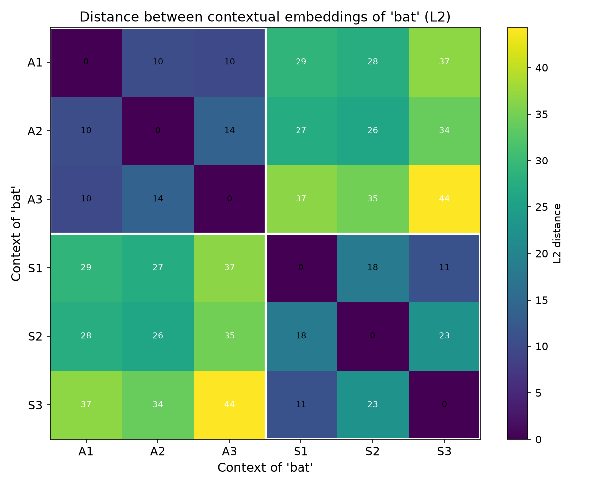

# Projekt 5: Embeddings & Polysemie — „Ein Embedding ist nicht genug"

**Was es macht:** Zeigt, wie GPT-2 das Wort „bat" je nach Kontext unterschiedlich darstellt — der Beweis, dass ein einziges statisches Embedding nicht alle Bedeutungen eines Wortes abbilden kann.

**Warum es wichtig ist:** Das ist Stufe 3 eines LLM — die Brücke zwischen Tokens und Bedeutung. Wer kontextuelle Embeddings versteht, versteht, warum dasselbe Wort in verschiedenen Sätzen eine andere Bedeutung hat und warum moderne LLMs Mehrdeutigkeit verarbeiten können.

## Konzepte

- **Statische Embeddings:** ein Dictionary-Lookup — ein fester Vektor pro Token
- **Kontextuelle Embeddings:** das Modell verändert den Vektor je nach umgebenden Wörtern
- **Polysemie:** ein Wort („bat") mit mehreren Bedeutungen („Tier" vs. „Baseball-Schläger")
- **Causale Aufmerksamkeit:** GPT-2 „sieht" nur den linken Kontext, daher muss das unterscheidende Merkmal vor dem Zielwort stehen
- **Ähnlichkeitsmessung:** L2-Distanz — kleinere Distanz = näher im Bedeutungsraum

## Wie die Distanz gemessen wird

Jedes Embedding ist ein Vektor aus 768 Zahlen — ein Punkt im 768-dimensionalen Raum.
Die L2-Distanz (euklidische Distanz) zwischen zwei Embeddings ist die geradlinige
Entfernung zwischen diesen beiden Punkten. Hätte ein Vektor nur 2 Zahlen, wäre er
ein Punkt auf einer Karte, und die Distanz wäre √((x₂−x₁)² + (y₂−y₁)²). Mit 768
Zahlen gilt dasselbe Prinzip: die Differenz pro Koordinate nehmen, jede
quadrieren, alle summieren, Wurzel ziehen.

Denk an die Vitalwerte eines Patienten als Vektor [HF, RR, SpO₂, Temp]. Zwei
Patienten mit identischen Werten → Distanz 0. Ein Patient mit Fieber und niedrigem
Sauerstoffwert liegt weit entfernt von einem gesunden. „Distanz" = wie
unterschiedlich das Gesamtbild ist.

Eine kleine Distanz (≈10–18) bedeutet also, dass die beiden „bat"-Embeddings in
ihrer Bedeutung fast identisch sind; eine große (≈33), dass das Modell sie weit
voneinander im Bedeutungsraum platziert hat.

## Ausführung

```bash
pip install -r requirements.txt
python embeddings.py
```

## Erwartete Ausgabe

```
Loading model: gpt2 ...
  Ready! Embedding dimension: 768

=================================================================
  Static embedding of 'bat' (dictionary lookup)
=================================================================
  A vector of 768 numbers, e.g. first 5: [-0.019, -0.139, 0.252, 0.16, 0.08]
  This vector is IDENTICAL in every sentence.

=================================================================
  Contextual embeddings — the proof
=================================================================
  L2 distance matrix of 'bat' embeddings (smaller = closer):

              A1      A2      A3      S1      S2      S3
        -------------------------------------------------
  A1         0.0    10.4     9.7    29.0    27.6    36.7
  A2        10.4     0.0    13.8    27.3    25.9    34.0
  A3         9.7    13.8     0.0    36.5    34.9    44.3
  S1        29.0    27.3    36.5     0.0    18.1    11.1
  S2        27.6    25.9    34.9    18.1     0.0    22.5
  S3        36.7    34.0    44.3    11.1    22.5     0.0

  KEY NUMBERS:
    within-meaning (animal vs animal):    11.3
    within-meaning (sports vs sports):    17.3
    between-meaning (animal vs sports):   32.9
    ratio (between / within):            2.30x

Heatmap saved to: embeddings_distance_heatmap.png
```



## Was ich gelernt habe

1. **Statisch ≠ kontextuell.** Das Dictionary-Embedding von „bat" ist ein fester Vektor — er kann ein fliegendes Tier nicht von einem Baseball-Schläger unterscheiden. Das Modell muss Bedeutung aus dem Kontext aufbauen.

2. **Kontext zählt, aber nur von links.** GPT-2 nutzt causale Aufmerksamkeit: Beim Verarbeiten von „bat" stehen nur Tokens davor zur Verfügung. Ich habe das durch echtes Debugging entdeckt — „bat" an Position 1 erzeugte für zwei gegensätzliche Sätze identische Embeddings (Distanz 0.0).

3. **Distanz ist ein Bedeutungsmesser.** Sätze mit gleicher Bedeutung gruppieren sich eng (L2 ≈ 10–18); verschiedene Bedeutungen sind etwa 2,3× weiter entfernt (L2 ≈ 33). Die Heatmap zeigt zwei klare Blöcke.

4. **Deshalb funktionieren RAG und Suche.** Wenn Modelle Wörter in Koordinaten im Bedeutungsraum verwandeln, liegen „Arzt" und „Mediziner" nahe beieinander — so findet semantische Suche relevante Texte, selbst ohne gleiche Schlüsselwörter.

## Tech-Stack

- Python 3.14
- PyTorch 2.13 (CPU)
- HuggingFace Transformers 5.14
- Matplotlib + NumPy (Heatmap)
- Modell: GPT-2 (124 Mio. Parameter)
